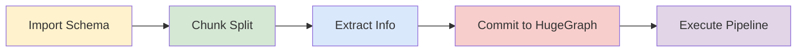
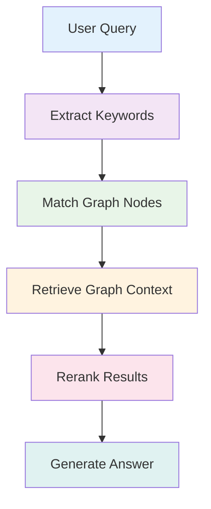

# HugeGraph-LLM [](https://deepwiki.com/apache/incubator-hugegraph-ai)

> **Bridge the gap between Graph Databases and Large Language Models**

## 🎯 Overview

HugeGraph-LLM is a comprehensive toolkit that combines the power of graph databases with large language models. It enables seamless integration between HugeGraph and LLMs for building intelligent applications.

### Key Features
- 🏗️ **Knowledge Graph Construction** - Build KGs automatically using LLMs + HugeGraph  
- 🗣️ **Natural Language Querying** - Operate graph databases using natural language (Gremlin/Cypher)
- 🔍 **Graph-Enhanced RAG** - Leverage knowledge graphs to improve answer accuracy (GraphRAG & Graph Agent)

For detailed source code doc, visit our [DeepWiki](https://deepwiki.com/apache/incubator-hugegraph-ai) page. (Recommended)

## 📋 Prerequisites

> [!IMPORTANT]
> - python 3.10+ (not tested in 3.12)
> - hugegraph-server 1.3+ (better to use 1.5+)
> - uv 0.7+

## 3. Deployment Options

You can choose one of the following two deployment methods:

### 3.1 Docker Deployment

**Docker Deployment**  
   Deploy HugeGraph-AI using Docker for quick setup:
   - Ensure Docker is installed
   - We provide two container images to choose from:
     - **Image 1**: [hugegraph/rag](https://hub.docker.com/r/hugegraph/rag/tags)  
       For building and running RAG functionality for rapid deployment and direct source code modification
     - **Image 2**: [hugegraph/rag-bin](https://hub.docker.com/r/hugegraph/rag-bin/tags)  
       A binary translation of C compiled with Nuitka, for better performance and efficiency.
   - Pull one of the Docker images:
     ```bash
     docker pull hugegraph/rag:latest     # Pull Image 1
     docker pull hugegraph/rag-bin:latest # Pull Image 2
     ```
   - Start one of the Docker containers:
     ```bash
     # Replace '/path/to/.env' with your actual .env file path
     docker run -itd --name rag -v /path/to/.env:/home/work/hugegraph-llm/.env -p 8001:8001 hugegraph/rag
     # or
     docker run -itd --name rag-bin -v /path/to/.env:/home/work/hugegraph-llm/.env -p 8001:8001 hugegraph/rag-bin
     ```
   - Access the interface at http://localhost:8001

### 3.2 Build from Source

1. Start the HugeGraph database, you can run it via [Docker](https://hub.docker.com/r/hugegraph/hugegraph)/[Binary Package](https://hugegraph.apache.org/docs/download/download/)
    There is a simple method by docker:  
    ```bash
   docker run -itd --name=server -p 8080:8080 hugegraph/hugegraph
    ```  
   You can refer to the detailed documents [doc](/docs/quickstart/hugegraph/hugegraph-server/#31-use-docker-container-convenient-for-testdev) for more guidance.

2. Configure the uv environment by using the official installer to install uv. See the [uv documentation](https://docs.astral.sh/uv/configuration/installer/) for other installation methods
    ```bash
    # You could try pipx or pip to install uv when meet network issues, refer the uv doc for more details
    curl -LsSf https://astral.sh/uv/install.sh | sh # install the latest version like 0.7.3+
    ```

3. Clone this project
    ```bash
    git clone https://github.com/apache/incubator-hugegraph-ai.git
    ```
4. Configure dependency environment.(For workspace projects, all uv commands should be run in the project root directory.)
    ```bash
    cd incubator-hugegraph-ai/
    uv venv && source .venv/bin/activate
    uv sync --extra all # You can also choose to install only specific dependencies here
    cd hugegraph-llm/
    ```  
    If dependency download fails or too slow due to network issues, it is recommended to modify `hugegraph-llm/pyproject.toml`.

5. To start the Gradio interactive demo for **Graph RAG**, run the following command, then open http://127.0.0.1:8001 in your browser.
    ```bash
    python -m hugegraph_llm.demo.rag_demo.app  # same as "uv run xxx"
    ```
    The default host is `0.0.0.0` and the port is `8001`. You can change them by passing command line arguments`--host` and `--port`.  
    ```bash
    python -m hugegraph_llm.demo.rag_demo.app --host 127.0.0.1 --port 18001
    ```
   
6. After running the web demo, the config file `.env` will be automatically generated at the path `hugegraph-llm/.env`. Additionally, a prompt-related configuration file `config_prompt.yaml` will also be generated at the path `hugegraph-llm/src/hugegraph_llm/resources/demo/config_prompt.yaml`.
    You can modify the content on the web page, and it will be automatically saved to the configuration file after the corresponding feature is triggered.  You can also modify the file directly without restarting the web application; refresh the page to load your latest changes.  
    (Optional)To regenerate the config file, you can use `config.generate` with `-u` or `--update`.  
    ```bash
    python -m hugegraph_llm.config.generate --update
    ```
    Note: `Litellm` support multi-LLM provider, refer [litellm.ai](https://docs.litellm.ai/docs/providers) to config it
7. (__Optional__) You could use 
    [hugegraph-hubble](/docs/quickstart/toolchain/hugegraph-hubble/#21-use-docker-convenient-for-testdev) 
    to visit the graph data, could run it via [Docker/Docker-Compose](https://hub.docker.com/r/hugegraph/hubble) 
    for guidance. (Hubble is a graph-analysis dashboard that includes data loading/schema management/graph traverser/display).
8. (__Optional__) offline download NLTK stopwords  
    ```bash
    python ./hugegraph_llm/operators/common_op/nltk_helper.py
    ```   
> [!TIP]
> Check our [Quick Start Guide](https://github.com/apache/incubator-hugegraph-ai/blob/main/hugegraph-llm/quick_start.md) for detailed usage examples and query logic explanations.

## 💡 Usage Examples

### Knowledge Graph Construction

#### Interactive Web Interface

Use the Gradio interface for visual knowledge graph building:

**Input Options:**
- **Text**: Direct text input for RAG index creation
- **Files**: Upload TXT or DOCX files (multiple selection supported)

**Schema Configuration:**
- **Custom Schema**: JSON format following our [template](https://github.com/apache/incubator-hugegraph-ai/blob/aff3bbe25fa91c3414947a196131be812c20ef11/hugegraph-llm/src/hugegraph_llm/config/config_data.py#L125)
- **HugeGraph Schema**: Use existing graph instance schema (e.g., "hugegraph")


#### Programmatic Construction

Build knowledge graphs with code using the `KgBuilder` class:

```python
from hugegraph_llm.models.llms.init_llm import LLMs
from hugegraph_llm.operators.kg_construction_task import KgBuilder

# Initialize and chain operations
TEXT = "Your input text here..."
builder = KgBuilder(LLMs().get_chat_llm())

(
    builder
    .import_schema(from_hugegraph="talent_graph").print_result()
    .chunk_split(TEXT).print_result()
    .extract_info(extract_type="property_graph").print_result()
    .commit_to_hugegraph()
    .run()
)
```

**Pipeline Workflow:**


### Graph-Enhanced RAG

Leverage HugeGraph for retrieval-augmented generation:

```python
from hugegraph_llm.operators.graph_rag_task import RAGPipeline

# Initialize RAG pipeline
graph_rag = RAGPipeline()

# Execute RAG workflow
(
    graph_rag
    .extract_keywords(text="Tell me about Al Pacino.")
    .keywords_to_vid()
    .query_graphdb(max_deep=2, max_graph_items=30)
    .merge_dedup_rerank()
    .synthesize_answer(vector_only_answer=False, graph_only_answer=True)
    .run(verbose=True)
)
```

**RAG Pipeline Flow:**


## 🔧 Configuration

After running the demo, configuration files are automatically generated:

- **Environment**: `hugegraph-llm/.env`
- **Prompts**: `hugegraph-llm/src/hugegraph_llm/resources/demo/config_prompt.yaml`

> [!NOTE]
> Configuration changes are automatically saved when using the web interface. For manual changes, simply refresh the page to load updates.

**LLM Provider Support**: This project uses [LiteLLM](https://docs.litellm.ai/docs/providers) for multi-provider LLM support.

## 📚 Additional Resources

- **Graph Visualization**: Use [HugeGraph Hubble](https://hub.docker.com/r/hugegraph/hubble) for data analysis and schema management
- **API Documentation**: Explore our REST API endpoints for integration
- **Community**: Join our discussions and contribute to the project

---

**License**: Apache License 2.0 | **Community**: [Apache HugeGraph](https://hugegraph.apache.org/)
