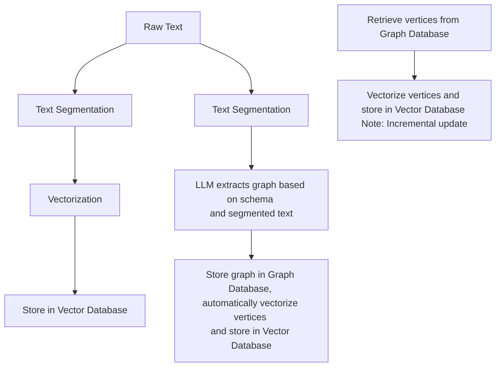
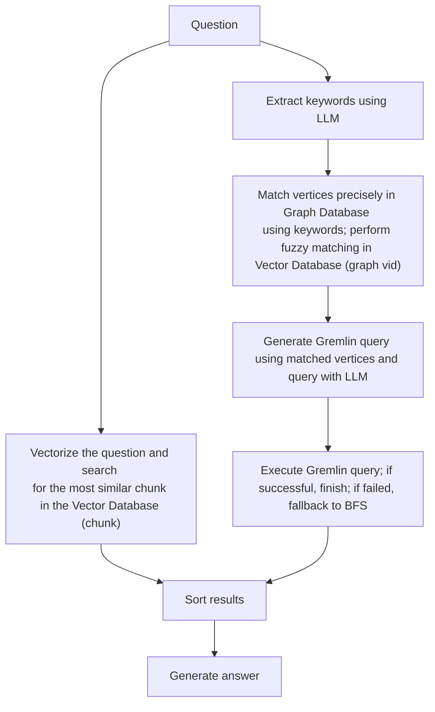
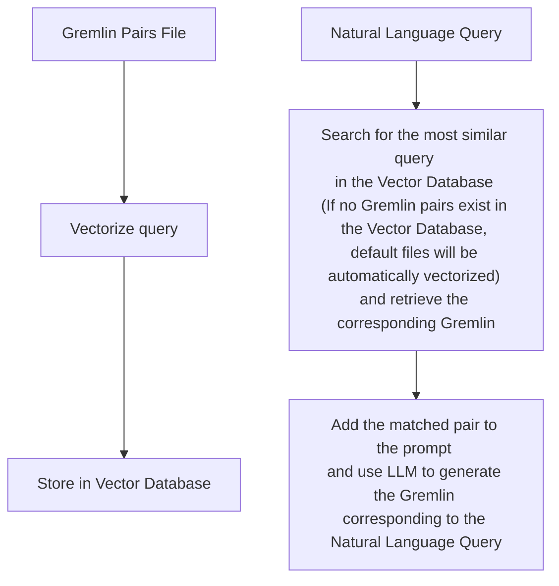
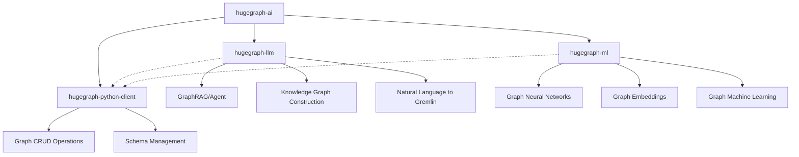

# [Feature] Add Mermaid diagram rendering support

## 🎯 Feature Description

### Current Situation
The project currently uses Mermaid syntax in documentation files (e.g., `hugegraph-llm/quick_start.md`) but these diagrams are not being rendered properly. The Mermaid code blocks are displayed as raw text instead of rendered diagrams.

**具体问题：**
1. `quick_start.md` 中的 3 个 mermaid 流程图无法正常渲染
2. README.md 中的项目架构图也无法正常显示
3. 用户只能看到原始的 mermaid 代码，无法理解项目的流程和架构

### Proposed Solution
Add Mermaid diagram rendering support to properly display flowcharts, sequence diagrams, and other visual representations in the documentation.

## 📋 Benefits

1. **Better Documentation**: Visual diagrams make complex workflows easier to understand
2. **Consistent Experience**: All Mermaid diagrams across the project will render properly
3. **Enhanced User Experience**: Users can better understand the project's architecture and workflows
4. **Professional Appearance**: Rendered diagrams give the project a more polished look

## 🔧 Implementation Options

### Option 1: GitHub Pages Integration (推荐)
- Configure GitHub Pages to render Mermaid diagrams
- Use Jekyll with Mermaid plugin
- Pros: Native GitHub integration, automatic updates
- Cons: Requires additional setup

### Option 2: Documentation Site
- Set up a documentation site using MkDocs, Docusaurus, or similar
- Configure Mermaid support in the chosen platform
- Pros: Full control over styling and features
- Cons: Additional infrastructure to maintain

### Option 3: README Enhancement
- Use GitHub's built-in Mermaid support in README files
- Pros: Simple, no additional setup required
- Cons: Limited to README files only

### Option 4: CI/CD Integration
- Add a build step to convert Mermaid to images
- Store generated images in the repository
- Pros: Works everywhere, no runtime dependencies
- Cons: Manual process, images need to be updated

## 📁 Files Currently Using Mermaid

- `hugegraph-llm/quick_start.md` (3 Mermaid diagrams)
  - Build RAG Index flow
  - Graph RAG Query flow  
  - Text2Gremlin flow
- `README.md` (1 Mermaid diagram)
  - Project Architecture diagram

## 📊 Example Mermaid Diagrams in Project

### 1. Build RAG Index Flow (quick_start.md)


### 2. Graph RAG Query Flow (quick_start.md)


### 3. Text2Gremlin Flow (quick_start.md)


### 4. Project Architecture (README.md)


## 🎯 Priority

**Medium** - This would improve documentation quality and user experience but is not critical for core functionality.

## 💡 Additional Considerations

- Consider adding Mermaid syntax highlighting in code editors
- Ensure diagrams are accessible (alt text, etc.)
- Consider adding a diagram gallery or index page
- Evaluate performance impact of rendering large diagrams
- Consider versioning strategy for diagram updates

## 🔍 Related Issues

- This issue addresses the growing trend of using Mermaid diagrams in documentation
- Improves the overall developer experience when reading project documentation
- Aligns with modern documentation best practices

## 📝 Acceptance Criteria

- [ ] Mermaid diagrams render properly in project documentation
- [ ] All existing Mermaid code blocks display as visual diagrams
- [ ] New diagrams can be easily added following established patterns
- [ ] Documentation is updated to include Mermaid usage guidelines
- [ ] CI/CD pipeline includes validation for Mermaid syntax (if applicable)

## 🚀 Quick Fix Options

### 临时解决方案 1: 使用 GitHub 内置支持
在 README.md 文件顶部添加：
```html
<script src="https://cdn.jsdelivr.net/npm/mermaid/dist/mermaid.min.js"></script>
<script>mermaid.initialize({startOnLoad:true});</script>
```

### 临时解决方案 2: 转换为图片
使用在线工具将 mermaid 代码转换为图片，然后替换代码块：
- https://mermaid.live/
- https://mermaid-js.github.io/mermaid-live-editor/

### 临时解决方案 3: 使用 GitHub Pages
1. 启用 GitHub Pages
2. 创建 `_config.yml` 文件
3. 添加 mermaid 插件配置

---

**Labels**: `feature`, `documentation`, `enhancement`, `good first issue`
**Priority**: Medium
**Estimated Effort**: 1-2 days 