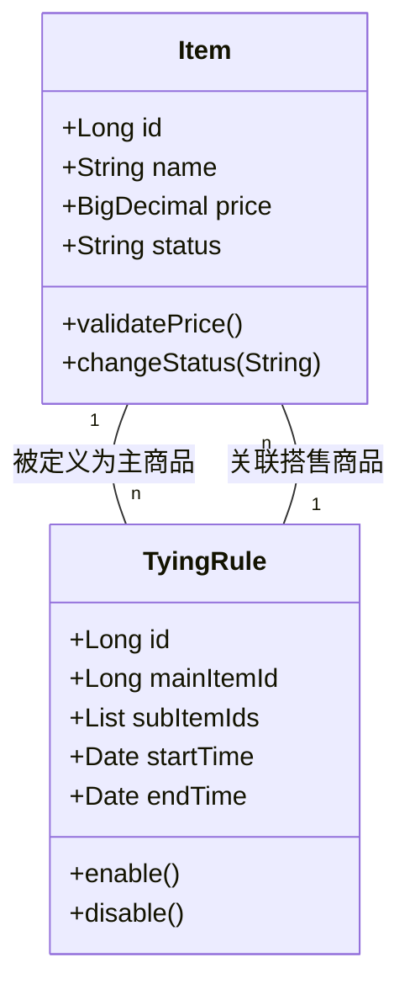

# 项目文档规范

**文档受众明确为软件开发人员**，目的是帮助开发团队快速理解系统架构、业务逻辑和技术实现细节，便于代码维护、功能扩展和知识传递。

## 关键规则

- 项目文档必须包含四个核心部分：项目简介、核心领域模型、项目结构和外部依赖
- 接口文档必须按照 @接口文档规范 进行编写和维护
- 业务流程文档必须按照 @业务流程文档规范 进行编写和维护
- 文档应保持客观性，基于现有代码而非理想状态
- 文档中使用的术语必须与代码中的术语保持一致
- 文档应使用 Markdown 格式，支持图表、表格和代码块
- 代码示例必须是从实际代码中提取的，而非虚构的
- 图表应使用 Mermaid 或 PlantUML 语法，以确保可维护性
- 文档应当引用具体的代码文件路径，便于读者查找相关实现
- 所有文档必须统一放置在 `docs` 目录下，并使用规定的中文名称
- **文档生成过程中必须确保完整覆盖所有内容，不允许任何遗漏**

## 文档优化与结构指南

- **主索引文档**：每个核心部分创建一个主索引文档，包含子文档链接和简要说明
- **文档内导航**：超过 500 行的文档必须在开头提供目录
- **分层结构**：按照“金字塔结构”组织（顶层：核心概念；中层：主要功能模块；底层：具体实现细节）
- **文档拆分**：接口超过 20 个时按业务域拆分；核心实体超过 10 个时按业务领域拆分

## 文档结构和内容要求

### 1. 项目简介 - `docs/{module_name}/README.md`

必须包含：项目背景、项目目标、功能概述、技术栈和架构类型（明确是否使用 GBF 框架）

### 2. 核心领域模型 - `docs/{module_name}/领域模型说明.md`

必须包含：

- 领域模型概述：核心业务概念的定义和边界
- 核心实体关系图：使用 E-R 图或类图表示
- 关键业务场景下的模型交互
- 数据流转关系

**强制性领域模型扫描规则**：

- **全面扫描**：包括领域实体文件（如 `*Entity.ts`, `*Model.py`, `*Entity.java`），以及使用了 ORM 框架注解（如 `@Entity`, `@Table`, `@Document`）的类文件、服务层的核心模型、DTO/VO 类等。
- **按目录结构识别**：识别位于通用领域模型目录（如 `models`, `domain`, `entities`）及其子目录下的源文件。
- **完整提取**：实体属性和业务含义、实体关系、聚合结构、生命周期和状态流转
- **识别规则**：属性约束、实体关系约束、状态转换规则

**领域模型分析策略**：

- 全域扫描实体类和值对象，支持多种 ORM 框架
- 提取关联关系（通过字段类型、泛型参数和 ORM 注解）
- 识别聚合根和聚合边界（通过包结构和类间关系）
- 分析继承结构（包括抽象类、接口和实现类）
- 提取业务方法和状态转换逻辑
- 生成完整属性表和业务规则说明

**特定框架项目补充**：对于使用特定业务框架（如 Spring, Django, RoR）的项目，需补充说明其扩展点定义与实现、场景定制点、路由与动态选择机制等。

### 3. 接口文档 - `docs/{module_name}/接口文档.md`

接口文档应遵循专门的规范进行创建和维护，以确保 API 接口的完整记录和更新。

### 4. 业务流程 - `docs/{module_name}/业务流程说明.md`

业务流程文档应遵循专门的规范进行创建和维护，以确保业务流程的完整记录和更新。

### 5. 项目结构 - `docs/{module_name}/项目结构说明.md`

必须包含：项目模块划分、代码组织结构、关键包说明、分层架构说明
**特定框架项目补充** - `docs/{module_name}/框架应用说明.md`：
特定框架的分层结构、扩展点文件位置、业务定制目录等。

### 6. 外部依赖与下游服务 - `docs/{module_name}/外部依赖说明.md`

必须包含：

- 下游服务概述：依赖的所有外部服务列表和用途
- 调用关系图：系统与外部服务的调用关系

## 文档生成工作流程

1.  **架构识别**：确定项目架构类型、识别关键组件和分层结构
2.  **代码分析**：识别核心业务包和类、分析领域模型、提取接口定义、理解调用链路
3.  **内容整理**：按文档结构组织信息、提取代码示例、绘制图表
4.  **审核完善**：验证文档与代码一致性、补充关键信息、完善图表和示例
    - **接口覆盖性验证**：确认总览文档中的所有接口都在详细文档中有完整描述
    - **文档完整性检查**：确保没有遗漏任何必要的接口和服务描述
5.  **定期更新**：与代码审查流程集成、重大变更更新文档、每季度全面审核

## 示例

### 领域模型示例

#### 核心实体关系图



#### 实体属性详细说明

##### Item 商品实体

| 属性名    | 类型         | 说明                                              |
|:-------|:-----------|:------------------------------------------------|
| id     | Long       | 商品唯一标识                                          |
| name   | String     | 商品名称，长度限制：2-50 个字符                              |
| price  | BigDecimal | 商品价格，精确到小数点后 2 位，最小值：0.01                       |
| status | String     | 商品状态，枚举值：ON_SHELF(上架)、OFF_SHELF(下架)、DELETED(删除) |

###### 业务规则

- 商品价格必须大于 0
- 商品状态只能按特定流程转换（上架->下架->删除）

### 业务流程示例

#### 搭售规则创建流程

##### 核心流程图

```mermaid
flowchart TD
    A[创建请求] --&gt; B{校验参数}
    B --&gt;|无效| C[返回错误]
    B --&gt;|有效| D[查询主商品]
    D --&gt; E{商品存在?}
    E --&gt;|否| F[返回错误]
    E --&gt;|是| G[查询搭售商品]
    G --&gt; H{商品存在?}
    H --&gt;|否| I[返回错误]
    H --&gt;|是| J[保存规则]
    J --&gt; K[返回成功]
```

##### 调用链路

**入口点**: `ItemTyingController.createTyingRule()`

**调用流程**:

1.  请求参数校验 - `validateTyingRequest(request)`
2.  查询主商品信息 - `itemService.getItemById()`
3.  校验主商品状态 - `validateItemStatus(item)`
4.  查询并校验搭售商品列表 - `validateSubItems()`
5.  构建并保存搭售规则 - `tyingRuleRepository.save()`
6.  发送规则创建事件 - `eventPublisher.publishEvent()`

##### 关键判断点

| 判断点    | 条件        | 处理路径      |
|:-------|:----------|:----------|
| 参数校验   | 主商品 ID 为空 | 返回参数错误    |
| 主商品校验  | 主商品不存在    | 返回商品不存在错误 |
| 搭售商品校验 | 存在无效商品    | 返回商品无效错误  |
