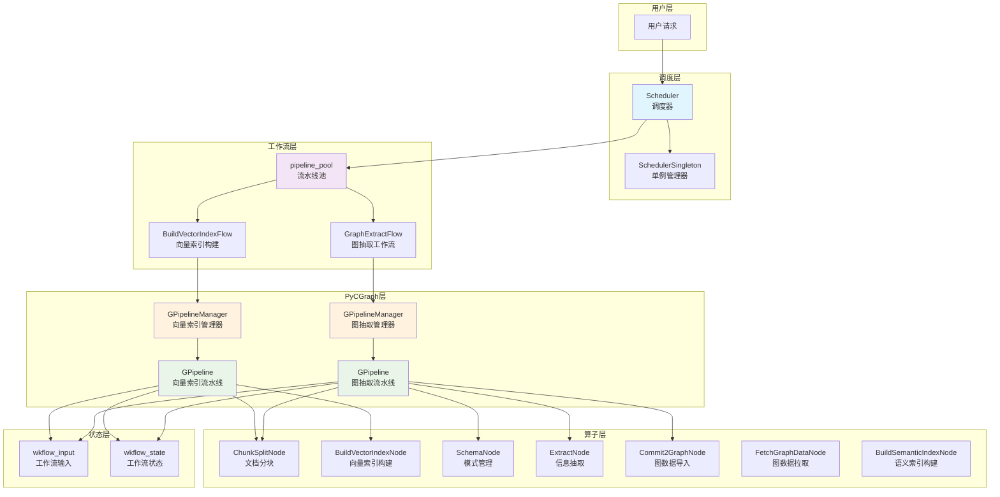
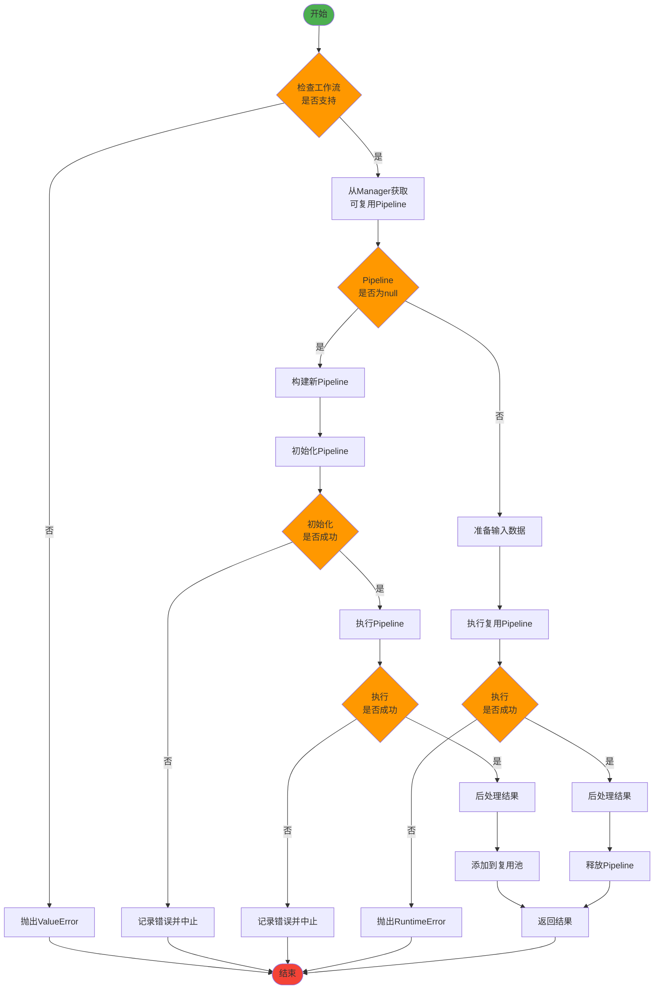

# Hugegraph-ai 固定工作流执行引擎设计文档

## 概述

Hugegraph固定工作流执行引擎是用来执行固定工作流的工作流执行引擎，每个工作流对应到实际Web Demo的一个具体用例，包括向量索引的构建，图索引的构建等等。该引擎基于PyCGraph框架构建，提供了高性能、可复用的流水线调度能力。

### 设计目标

- **性能优异**：通过流水线复用机制保证固定工作流的执行性能
- **高可靠性**：确保数据一致性和故障恢复能力，提供完善的错误处理机制
- **易于扩展**：能够简单轻松地新增固定工作流，支持动态调度
- **资源优化**：通过流水线池化管理，减少重复构图开销

### 技术栈

- **PyCGraph**：基于C++的高性能图计算框架，提供GPipeline和GPipelineManager
- **Python**：主要开发语言，提供业务逻辑和接口层
- **Threading**：支持并发调度和线程安全

### 模块分层
```text
hugegraph-llm/
└── src/
    └── hugegraph_llm/
        ├── api/           # FastAPI 接口层，提供 rag_api、admin_api 等服务
        ├── config/        # 配置管理，包含各类配置与生成工具
        ├── demo/          # Gradio Web Demo 及相关交互应用
        ├── document/      # 文档处理与分块等工具
        ├── enums/         # 枚举类型定义
        ├── flows/         # 工作流调度与核心流程（如向量/图索引构建、数据导入等）
        │   ├── __init__.py
        │   ├── common.py          # BaseFlow抽象基类
        │   ├── scheduler.py       # 调度器核心实现
        │   ├── build_vector_index.py  # 向量索引构建工作流
        │   ├── graph_extract.py   # 图抽取工作流
        │   ├── import_graph_data.py   # 图数据导入工作流
        │   ├── update_vid_embeddings.py # 向量更新工作流
        │   ├── get_graph_index_info.py # 图索引信息获取工作流
        │   ├── build_schema.py # 模式构建工作流
        │   └── prompt_generate.py # 提示词生成工作流
        ├── indices/       # 各类索引实现（向量、图、关键词等）
        ├── middleware/    # 中间件与请求处理
        ├── models/        # LLM、Embedding、Reranker 等模型相关
        ├── nodes/         # Node调度层，负责Operator生命周期和上下文管理
        │   ├── base_node.py
        │   ├── document_node/
        │   ├── hugegraph_node/
        │   ├── index_node/
        │   ├── llm_node/
        │   └── util.py
        ├── operators/     # 主要算子与任务（如 KG 构建、GraphRAG、Text2Gremlin 等）
        ├── resources/     # 资源文件（Prompt、示例、Gremlin 模板等）
        ├── state/         # 状态管理
        ├── utils/         # 工具类与通用方法
        └── __init__.py    # 包初始化
```

## 架构设计

### 整体架构

> 新架构在Flow与Operator之间引入Node层，Node负责Operator的生命周期管理、上下文绑定、参数区解耦和并发安全，所有Flow均通过Node组装，Operator只关注业务实现。

#### 架构图



#### 调度流程图



### 核心组件

#### 1. Scheduler（调度器）
- **职责**：调度中心，维护 `pipeline_pool`，提供统一的工作流调度接口
- **特性**：
  - 支持多种工作流类型（build_vector_index、graph_extract、import_graph_data、update_vid_embeddings、get_graph_index_info、build_schema、prompt_generate等）
  - 流水线池化管理，支持复用
  - 线程安全的单例模式
  - 可配置的最大流水线数量

#### 2. GPipelineManager（流水线管理器）
- **来源**：PyCGraph框架提供
- **职责**：负责流水线对象 `GPipeline` 的获取、添加、释放与复用
- **特性**：
  - 自动管理流水线生命周期
  - 支持流水线复用和资源回收
  - 提供fetch/add/release操作接口

#### 3. BaseFlow（工作流基类）
- **职责**：工作流构建与前后处理抽象
- **接口**：
  - `prepare()`: 预处理接口，准备输入数据
  - `build_flow()`: 组装Node并注册依赖关系
  - `post_deal()`: 后处理接口，处理执行结果
- **实现**：
  - `BuildVectorIndexFlow`: 向量索引构建工作流
  - `GraphExtractFlow`: 图抽取工作流
  - `ImportGraphDataFlow`: 图数据导入工作流
  - `UpdateVidEmbeddingsFlow`: 向量更新工作流
  - `GetGraphIndexInfoFlow`: 图索引信息获取工作流
  - `BuildSchemaFlow`: 模式构建工作流
  - `PromptGenerateFlow`: 提示词生成工作流

#### 4. Node（节点调度器）
- **职责**：作为Operator的生命周期管理者，负责参数区绑定、上下文初始化、并发安全、异常处理等。
- **特性**：
  - 统一生命周期接口（init、node_init、run、operator_schedule）
  - 通过参数区（wkflow_input/wkflow_state）与Flow/Operator解耦
  - Operator只需实现run(data_json)方法，Node负责调度和结果写回
  - 典型Node如：ChunkSplitNode、BuildVectorIndexNode、SchemaNode、ExtractNode、Commit2GraphNode、FetchGraphDataNode、BuildSemanticIndexNode、SchemaBuildNode、PromptGenerateNode等

#### 5. Operator（算子）
- **职责**：实现具体的业务原子操作
- **特性**：
  - 只需关注自身业务逻辑实现
  - 由Node统一调度

#### 6. GPipeline（流水线实例）
- **来源**：PyCGraph框架提供
- **职责**：具体流水线实例，包含参数区与节点DAG拓扑
- **参数区**：
  - `wkflow_input`: 流水线运行输入
  - `wkflow_state`: 流水线运行状态与中间结果

### 核心数据结构

```python
# Scheduler核心数据结构
Scheduler.pipeline_pool: Dict[str, Any] = {
    "build_vector_index": {
        "manager": GPipelineManager(),
        "flow": BuildVectorIndexFlow(),
    },
    "graph_extract": {
        "manager": GPipelineManager(),
        "flow": GraphExtractFlow(),
    }
}
```

### 调度流程

#### schedule_flow方法执行流程

1. **工作流验证**：校验 `flow` 是否受支持，查表获取对应的 `manager` 与 `flow` 实例

2. **流水线获取**：从 `manager.fetch()` 获取可复用的 `GPipeline`

3. **新流水线处理**（当fetch()返回None时）：
   - 调用 `flow.build_flow(*args, **kwargs)` 构建新流水线
   - 调用 `pipeline.init()` 完成初始化，失败则记录错误并中止
   - 调用 `pipeline.run()` 执行，失败则中止
   - 调用 `flow.post_deal(pipeline)` 生成输出
   - 调用 `manager.add(pipeline)` 将流水线加入可复用池

4. **复用流水线处理**（当fetch()返回现有流水线时）：
   - 从 `pipeline.getGParamWithNoEmpty("wkflow_input")` 获取输入对象
   - 调用 `flow.prepare(prepared_input, *args, **kwargs)` 进行参数刷新
   - 调用 `pipeline.run()` 执行，失败则中止
   - 调用 `flow.post_deal(pipeline)` 生成输出
   - 调用 `manager.release(pipeline)` 归还流水线

### 并发与复用策略

#### 线程安全
- `SchedulerSingleton` 使用双重检查锁保证全局单例
- 线程安全获取 `Scheduler` 实例

#### 资源管理
- 每种 `flow` 拥有独立的 `GPipelineManager`
- 最大并发量由 `Scheduler.max_pipeline` 与底层 `GPipelineManager` 策略共同约束
- 通过 `fetch/add/release` 机制减少重复构图的开销

#### 性能优化
- 流水线复用机制适合高频相同工作流场景
- 减少重复初始化和构图的时间开销
- 支持并发执行多个工作流实例

### 错误处理与日志

#### 错误检测
- 对 `init/run` 的 `Status.isErr()` 进行检测
- 统一抛出 `RuntimeError` 并记录详细 `status.getInfo()`
- 提供完整的错误堆栈信息

#### 日志记录
- 使用统一的日志系统记录关键操作
- 记录流水线执行状态和错误信息
- 支持不同级别的日志输出

#### 结果处理
- `flow.post_deal` 负责将 `wkflow_state` 转换为对外可消费结果（如JSON）
- 提供标准化的输出格式
- 支持错误信息的友好展示

### 扩展指引

#### 新增Node/Operator/Flow步骤
1. 实现Operator业务逻辑（如ChunkSplit/BuildVectorIndex/InfoExtract等）
2. 实现对应Node（继承BaseNode，负责参数区绑定和调度Operator）
3. 在Flow中组装Node，注册依赖关系
4. 在Scheduler注册新的Flow

#### 输入输出约定
- 统一使用 `wkflow_input` 作为输入载体
- 统一使用 `wkflow_state` 作为状态与结果容器
- 确保可复用流水线在不同请求间可被快速重置

#### 最佳实践
- 保持Flow类的无状态设计
- 合理使用流水线复用机制
- 提供完善的错误处理和日志记录
- 遵循统一的接口规范

## Flow对象设计

### BaseFlow抽象基类

```python
class BaseFlow(ABC):
    """
    Base class for flows, defines three interface methods: prepare, build_flow, and post_deal.
    """

    @abstractmethod
    def prepare(self, prepared_input: WkFlowInput, *args, **kwargs):
        """
        Pre-processing interface.
        """
        pass

    @abstractmethod
    def build_flow(self, *args, **kwargs):
        """
        Interface for building the flow.
        """
        pass

    @abstractmethod
    def post_deal(self, *args, **kwargs):
        """
        Post-processing interface.
        """
        pass
```

### 接口说明

每个Flow对象都需要实现三个核心接口：

- **prepare**: 用来准备整个workflow的输入数据，设置工作流参数
- **build_flow**: 用来构建整个workflow的流水线，注册节点和依赖关系
- **post_deal**: 用来处理workflow的执行结果，转换为对外输出格式

### 具体实现示例

#### BuildVectorIndexFlow（向量索引构建工作流）

```python
class BuildVectorIndexFlow(BaseFlow):
    def __init__(self):
        pass

    def prepare(self, prepared_input: WkFlowInput, texts):
        prepared_input.texts = texts
        prepared_input.language = "zh"
        prepared_input.split_type = "paragraph"
        return

    def build_flow(self, texts):
        pipeline = GPipeline()
        # prepare for workflow input
        prepared_input = WkFlowInput()
        self.prepare(prepared_input, texts)

        pipeline.createGParam(prepared_input, "wkflow_input")
        pipeline.createGParam(WkFlowState(), "wkflow_state")

        chunk_split_node = ChunkSplitNode()
        build_vector_node = BuildVectorIndexNode()
        pipeline.registerGElement(chunk_split_node, set(), "chunk_split")
        pipeline.registerGElement(build_vector_node, {chunk_split_node}, "build_vector")

        return pipeline

    def post_deal(self, pipeline=None):
        res = pipeline.getGParamWithNoEmpty("wkflow_state").to_json()
        return json.dumps(res, ensure_ascii=False, indent=2)
```

#### GraphExtractFlow（图抽取工作流）

```python
class GraphExtractFlow(BaseFlow):
    def __init__(self):
        pass

    def prepare(self, prepared_input: WkFlowInput, schema, texts, example_prompt, extract_type):
        prepared_input.texts = texts
        prepared_input.language = "zh"
        prepared_input.split_type = "document"
        prepared_input.example_prompt = example_prompt
        prepared_input.schema = schema
        return

    def build_flow(self, schema, texts, example_prompt, extract_type):
        pipeline = GPipeline()
        prepared_input = WkFlowInput()
        self.prepare(prepared_input, schema, texts, example_prompt, extract_type)

        pipeline.createGParam(prepared_input, "wkflow_input")
        pipeline.createGParam(WkFlowState(), "wkflow_state")
        schema_node = SchemaNode()

        chunk_split_node = ChunkSplitNode()
        graph_extract_node = ExtractNode()

        pipeline.registerGElement(schema_node, set(), "schema_node")
        pipeline.registerGElement(chunk_split_node, set(), "chunk_split")
        pipeline.registerGElement(
            graph_extract_node, {schema_node, chunk_split_node}, "graph_extract"
        )

        return pipeline

    def post_deal(self, pipeline=None):
        res = pipeline.getGParamWithNoEmpty("wkflow_state").to_json()
        vertices = res.get("vertices", [])
        edges = res.get("edges", [])
        if not vertices and not edges:
            log.info("Please check the schema.(The schema may not match the Doc)")
            return json.dumps(
                {
                    "vertices": vertices,
                    "edges": edges,
                    "warning": "The schema may not match the Doc",
                },
                ensure_ascii=False,
                indent=2,
            )
        return json.dumps(
            {"vertices": vertices, "edges": edges},
            ensure_ascii=False,
            indent=2,
        )
```

## Node对象设计

### 节点生命周期

节点以 GNode 为抽象基类，统一生命周期与状态返回。方法职责与约定如下：

#### 初始化阶段

- **init()**:
  - **责任**：完成节点级初始化工作（如绑定共享上下文、准备参数区），确保节点具备运行所需的最小环境
  - **约定**：仅做轻量初始化，不执行业务逻辑；返回状态用于判断是否可继续

- **node_init()**:
  - **责任**：解析与校验本次运行所需的输入（通常来自 wk_input），构建运行期依赖（如内部配置、变换器、资源句柄）
  - **约定**：输入缺失或不合法时，应返回错误状态并中止后续执行；不产生对外可见的业务结果

#### 运行阶段

- **run()**:
  - **责任**：执行业务主流程（纯计算或 I/O），在完成后将节点产出写入共享状态（wkflow_state/上下文）
  - **约定**：
    - 进入前应先调用 node_init() 并检查其返回状态
    - 对共享状态的写操作需遵循并发安全约定（如加锁/解锁）
    - 出错使用统一状态返回，不抛出未捕获异常到流程编排层

### 输入/输出与上下文约定

- **输入**：通过编排层预置于参数区（如 wk_input），节点在 node_init() 中读取并校验
- **输出**：通过共享状态容器（如 wkflow_state/上下文）对外暴露，键/字段命名应稳定可预期，供下游节点消费

### 错误处理约定

- 统一以状态对象表示成功/失败与信息；错误应尽早返回，避免在 run() 中继续副作用操作
- 对可预见的校验类错误使用明确的错误信息，便于定位问题与编排层记录

### 并发与可重入约定

- 共享状态的写入需在临界区内完成；读取视数据一致性要求决定是否加锁
- 节点应尽量保持无副作用或将副作用范围收敛在可控区域，以支持重试与复用

### 可测试性与解耦

- 业务纯逻辑应与框架交互解耦，优先封装为可单测的纯函数/内部方法
- 节点仅负责生命周期编排与上下文读写，具体策略与算法通过内部可替换组件提供

### 节点类型

#### 文档处理节点
- **ChunkSplitNode**: 文档分块处理节点
  - 功能：将输入文档按照指定策略进行分块
  - 输入：原始文档文本
  - 输出：分块后的文档片段

#### 索引构建节点
- **BuildVectorIndexNode**: 向量索引构建节点
  - 功能：基于文档分块构建向量索引
  - 输入：文档分块
  - 输出：向量索引数据

#### 模式管理节点
- **SchemaManagerNode**: 图模式管理节点
  - 功能：从HugeGraph获取图模式信息
  - 输入：图名称
  - 输出：图模式定义

- **CheckSchemaNode**: 模式校验节点
  - 功能：校验用户定义的图模式
  - 输入：用户定义的JSON模式
  - 输出：校验后的模式定义

#### 图抽取节点
- **InfoExtractNode**: 信息抽取节点
  - 功能：从文档中抽取三元组信息
  - 输入：文档分块和模式定义
  - 输出：抽取的三元组数据

- **PropertyGraphExtractNode**: 属性图抽取节点
  - 功能：从文档中抽取属性图结构
  - 输入：文档分块和模式定义
  - 输出：抽取的顶点和边数据

#### 模式构建节点
- **SchemaBuildNode**: 模式构建节点
  - 功能：基于文档和查询示例构建图模式
  - 输入：文档文本、查询示例、少样本模式
  - 输出：构建的图模式定义

#### 提示词生成节点
- **PromptGenerateNode**: 提示词生成节点
  - 功能：基于源文本、场景和示例名称生成提示词
  - 输入：源文本、场景、示例名称
  - 输出：生成的提示词


## 测试策略

### 测试目标

目前的测试策略主要目标是保证移植之后的workflow和移植之前的workflow执行结果、程序行为一致。

### 测试范围

#### 1. 功能测试
- **工作流执行结果一致性**：确保新架构下的工作流执行结果与原有实现完全一致
- **输入输出格式验证**：验证输入参数处理和输出格式转换的正确性
- **错误处理测试**：确保错误场景下的行为与预期一致

#### 2. 性能测试
- **流水线复用效果**：验证流水线复用机制的性能提升效果
- **并发执行测试**：测试多工作流并发执行的稳定性和性能
- **资源使用测试**：监控内存和CPU使用情况，确保资源使用合理

#### 3. 稳定性测试
- **长时间运行测试**：验证系统在长时间运行下的稳定性
- **异常恢复测试**：测试系统在异常情况下的恢复能力
- **内存泄漏测试**：确保流水线复用不会导致内存泄漏

### 测试方法

#### 1. 单元测试
- 对每个Flow类进行单元测试
- 对每个Node类进行单元测试
- 对Scheduler调度逻辑进行测试

#### 2. 集成测试
- 端到端工作流测试
- 多工作流组合测试
- 与外部系统集成测试

#### 3. 性能基准测试
- 建立性能基准线
- 对比新旧架构的性能差异
- 监控关键性能指标

### 测试数据

#### 1. 标准测试数据集
- 准备标准化的测试文档
- 准备标准化的图模式定义
- 准备标准化的期望输出结果

#### 2. 边界测试数据
- 空输入测试
- 大文件测试
- 特殊字符测试
- 异常格式测试

### 测试环境

#### 1. 开发环境测试
- 本地开发环境的功能验证
- 快速迭代测试

#### 2. 测试环境验证
- 模拟生产环境的完整测试
- 性能压力测试

#### 3. 生产环境验证
- 灰度发布验证
- 生产环境监控

### 测试自动化

#### 1. CI/CD集成
- 自动化测试流程集成
- 代码提交触发测试
- 测试结果自动报告

#### 2. 回归测试
- 定期执行回归测试
- 确保新功能不影响现有功能
- 性能回归检测

### 测试指标

#### 1. 功能指标
- 测试覆盖率 > 90%
- 功能正确性 100%
- 错误处理覆盖率 > 95%

#### 2. 性能指标
- 响应时间提升 > 20%
- 吞吐量提升 > 30%
- 资源使用优化 > 15%

#### 3. 稳定性指标
- 系统可用性 > 99.9%
- 平均故障恢复时间 < 5分钟
- 内存泄漏率 = 0%
